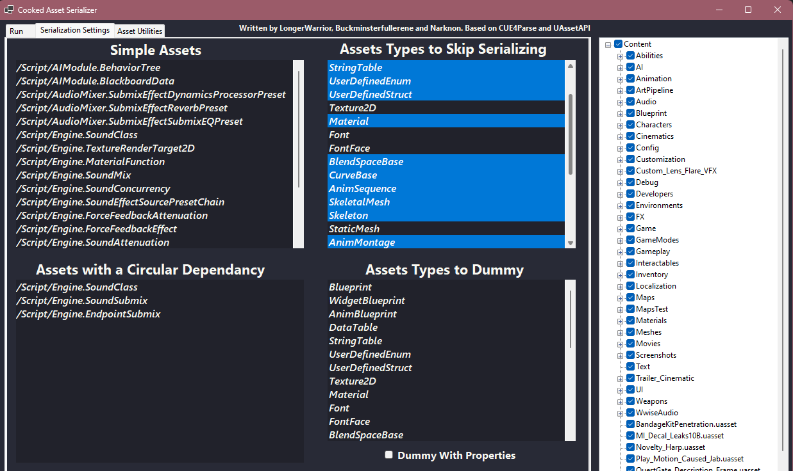
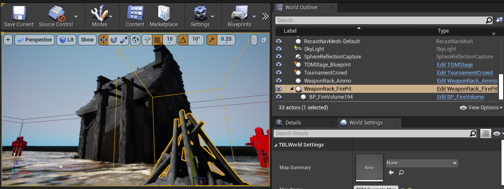

# ArgonSDK

- [ArgonSDK](#argonsdk)
  - [Overview](#overview)
  - [TBL-code-only-docs](#tbl-code-only-docs)
- [Unpaking assets](#unpaking-assets)
  - [prerequisites](#prerequisites)
  - [UnPAKing the game](#unpaking-the-game)
  - [Comparing SDK and original files](#comparing-sdk-and-original-files)
- [serializing unpaked assets](#serializing-unpaked-assets)
  - [Goal](#goal)
  - [Prerequisites](#prerequisites-1)
  - [CAS Setup](#cas-setup)
  - [crashes](#crashes)
- [Asset generation](#asset-generation)
  - [Prerequisites](#prerequisites-2)
  - [Installing asset generator](#installing-asset-generator)
  - [Using the Asset Generator](#using-the-asset-generator)
  - [Result](#result)
  - [Extra generated assets](#extra-generated-assets)
  - [editor tips](#editor-tips)
- [mod paking](#mod-paking)
  - [prerequisites](#prerequisites-3)
  - [Step 1: cooking](#step-1-cooking)
  - [Step 2: paking](#step-2-paking)
  - [Step 3: Installation](#step-3-installation)

## Overview

This is a "pre-release" version containing only (TBL) Source code.

Join [Chiv2 Unchained Discord](https://discord.gg/chiv2unchained) to be notified when additional content and docs/guides are released.

## TBL-code-only-docs

Generated Doxygen / Blueprint documentation is available here: https://github.com/Chiv2-Community/chiv2-tblcpp-obsidian-clean

_Install Obsidian and open the folder as vault. Hint: Enable "Show existing files only" in the graph to hide variables_

# Unpaking assets

Unpaking Chivalry 2 game assets. This is the first of a three-step process for using chivalry game assets in your custom maps/mods. 

1. Unpak game assets
2. Serialize unpaked game assets
3. Generate game assets for UE 4.25

## prerequisites

1. Chivalry 2 installed
2. UE 4.25 bin folder added to system path (This is so we can use built-in unreal engine tools from the commandline)

This is an example path to your unreal bin folder:
`C:\Path\to\unreal\install\UE_4.25\Engine\Binaries\Win64`
You will need to find your actual UE installation location and fill it in.

[How to add it to system path](https://www.architectryan.com/2018/03/17/add-to-the-path-on-windows-10/)

## UnPAKing the game
We can use the UnPak tool provided with Unreal Engine. This project include a wrapper for it. Make a folder where you want the files to be unpaked to, and drag the `chiv2unpak.bat` file into it. Then, drag your Chivalry 2 root folder onto the batch file.


The extraction process takes only a couple of minutes (on SSD). It will generate a filelist under ‘lista.txt’ and extract the data. You should see newly created _Engine_ and _TBL_ folders.

## Comparing SDK and original files

You don't *need* to do this, but these commands may be helpful for verifying.

Misc command to extract .uasset names: 
``` bash
grep ".uasset" lista.txt | cut -d "\"" -f 2 | sort > assetlist.txt
```

Same for SDK content folder 
``` bash
find "*.uasset" Content/ -type f | sort > out.txt
```
Get any assets not extracted: 
``` bash
grep -F -x -v -f out.txt assetlist.txt
```

# serializing unpaked assets

Preparing them for asset generation into Unreal Editor.

## Goal
* Convert cooked .uasset files to intermediary JSON format using “UEAssetToolkitGenerator” (CAS)
* _Asset list sorted by asset type as a bonus_

## Prerequisites

1. Extracted game assets
2. [UEAssetToolkitGenerator](https://github.com/LongerWarrior/UEAssetToolkitGenerator/releases) by LongerWarrior (CAS)
   * make sure you download the release zip. Do not clone the source

>[!caution]
> I strongly recommend reading [the Wiki pages](https://github.com/LongerWarrior/UEAssetToolkitGenerator/wiki) on CAS, especially about the generation process order.

## CAS Setup
Start CAS, populate the paths and select the correct UE version (4.25)


More info: [Understanding the GUI](https://github.com/LongerWarrior/UEAssetToolkitGenerator/wiki/Understanding-the-GUI)

On the **Serialization Settings** tab, skip serializing all asset types except for:
* Texture2D
* Font
* FontFace
* StaticMesh



>Important! On the main menu, save your current profile somewhere. This program will crash ***a lot*** during this process. Saving your profile and keeping **Auto Load Profile on Launch** checked will make those crashes less painful.

Click **Scan Assets** on the **Run** tab, and let it scan through all assets. This only needs to be done once. Make sure all folders on the right side are checked at first, then click the **Serialize Assets** button to start serializing assets.

~~~
TODO: find which types are safe to serialize at once
~~~
It can take approx 2 hours.

## crashes

This program crashes a lot. It will be serializing, and then just close. When this happens, compare your `CAS_Output` folder structure to the folder structure shown on the right-side of the CAS tool. You will find that the folder structure is created up to a certain point. CAS serialized directories in the order shown on the right side, top-down with each directory and it's subdirectories being fully completed before the next one down is started. 


Files in a directory are serialized before the subdirectories are. For example, the files in `Rabbit01` will be serialized before any files that might be in `Rabbit01\Animation`. From this, we can infer which file the CAS serializer crashed on. The crashing file may be the one that is present on disk, or it may be the one immediately after in the list.

1. Uncheck the directories that you can see have already been serialized so that CAS will not try to do them again. 
   * Unless **Refresh Assets** is checked, keeping already serialized assets checked will do nothing and only waste time as CAS goes through those files at about the same pace it did initially.
2. Uncheck the file(s) you believe are causing crashes
3. **save your profile to preserve these selections**
4. Try serializing again. Continue this process until you're done serializing everything.

# Asset generation

For using Chivalry assets in your custom maps/mods

## Prerequisites

1. Unreal engine 4.25 is installed
2. ArgonSDK cloned
3. [UEAssetToolkit-Fixes FBX-only branch](https://github.com/Knutschbert/UEAssetToolkit/tree/fbx-only) cloned
4. Assets are un-paked
5. These un-paked assets are serialized:
    * Texture2d
    * Staticmesh
    * FontFaces
    * Fonts

## Installing asset generator

Drag and drop these folders from the UEAssetToolkit-Fixes **FBX-Only** branch into the plugins folder of the ArgonSDK Unreal project directory


Open unreal engine, and browse to the location of your cloned ArgonSDK. Open the .uproject in that directory.


You will get a popup asking if you want to rebuild several modules (including the asset generator). Click yes and wait for them to build. You may need Visual Studio and it's toolchains installed to do this.


## Using the Asset Generator

> You should probably at least skim this section in it's entirety before starting. Do not start generating assets before reading the warnings and recommendations.

Open the asset generator tool here.


The asset generator window looks like this:


1. Set ***Dump Root Folder Path*** to wherever you put your CAS_output folder.
2. Set ***Assets To Generate Per Tick*** to 32 (the max). If performance is an issue or it's too strenuous on your computer, you can reduce this value.
3. Ensure that ALL asset types are selected in the ***Asset Type Filter*** section.
4. Select the paths you want to generate assets from.


>**IMPORTANT:** You should do this asset generation in batches. Check a few directories for generation, generate those, and then generate the next few directories. Keep an eye on your memory usage, and whenever you feel you don't have enough memory to do the next batch, restart the editor to free up some. 

Memory consumed by this process is **NOT** freed until the unreal editor is closed completely. If you try to do it all at once, you will get an out of memory error or a 100GB page file. If it crashes due to memory, I recommend re-doing the batch in two smaller chunks with the **Refresh Assets** checkbox in the generator checked in order to re-do any assets in that batch which may have been corrupted by the crash.

Some very large directories are:
* Characters
* Environemnts/Architecture
* Environments/Landscape
* Environments/Props
* UI
* Weapons

Split these directories up into batches, generating assets and then restarting the editor to free memory between batches. This process is long and tedious, and will take hours.

## Result
You should have had the following directory structure generated in ArgonSDK's Content folder:
```
ArgonSDK\Content
├── AI
├── Abilities
├── Animation
├── ArtPipeline
├── Audio
├── Blueprint
├── Characters
├── Cinematics
├── Collections
├── Config
├── Custom_Lens_Flare_VFX
├── Customization
├── Debug
├── Developers
├── Environments
├── FX
├── Game
├── GameModes
├── Gameplay
├── Interactables
├── Inventory
├── Localization
├── Maps
├── MapsTest
├── Materials
├── Meshes
├── Mods
├── Movies
├── Screenshots
├── Trailer_Cinematic
├── UI
└── Weapons
```
You will also be able to drag in-game assets into your maps, see them in the editor, and have them work when you load your map in-game



## Extra generated assets

Any asset types that were visible in the CAS tool in the **serializing unpaked assets** section that we skipped last time can also be serialized and generated. This takes time, and the end result isn't very big. The majority of these assets (like blueprints) have been serialized and subsequently generated by Nihi. Ask for a copy of these generated assets if you don't want to do them yourself.

## editor tips

Unreal will automatically cook these extracted assets when you cook your maps. This will take ***FOREVER*** with zero benefit to you. (Chivalry already has them in it's pak!) Mark these extracted directories as "never cook." That way, Unreal Engine will only leave the references to these assets in the map so they will be loaded from Chivalry's pak when needed.


# mod paking

For easy distribution after you've made your mod/map.

## prerequisites

1. Unreal engine 4.25 is installed
2. A mod that can be cooked to loose files and loaded in chivalry
3. [This unreal pak tool](https://www.fluffyquack.com/tools/unrealpak.rar)

## Step 1: cooking

Cook your mod as you normally would for loose files


## Step 2: paking

Extract the [unreal pak tool](https://www.fluffyquack.com/tools/unrealpak.rar) anywhere you want, and create a new folder for your mod. Replace `<your mod>` from here on out with whatever you want your mods to be called. Make new folders under `<your mod>` to replicate this folder structure, with your cooked assets going under the `Content` folder:

```
unrealpak
├── <your mod>
│   └── TBL
│       └── Content
│           └── Mods
│               ├── Maps
│               ├── UI
│               └── Weapons
├── UnrealPak-With-Compression.bat
├── UnrealPak-Without-Compression.bat
├── UnrealPak.exe
├── UnrealUnpak.bat
└── readme.txt
```

The internal folder structure of the pak file is signficant. If the folder structure above is not followed, then assets will not be loaded properly. You can get weird issues like the map itself loading, but not other assets referenced/used by that map. 

>The goal here is to maintain and comply with the internal Unreal Engine virtual file system rooted at `/game`. Our files want to end up at `/game/Content/Mods/...`, but if your folder structure is wrong then your assets can be loaded internally somewhere like `/game/Mods/customAsset.uasset` when your cooked umap internally expects them to be at `/game/Content/Mods/customAsset.uasset`. It's not immediately obvious that this is happening, and can be annyoing to track down.

You do not need to copy over any unpaked->serialized->generated game files used in your map that you may have cooked. The game will find those assets referenced in it's own pak.

In windows file explorer, drag and drop the `<your mod>` folder onto the `UnrealPak-With-Compression.bat` file to create a `<yourmod>.pak` file in that directory. You can do the same with `UnrealPak-Without-Compression.bat` if you don't want your files compressed


## Step 3: Installation

Paked mods cannot be installed the same way as loose file mods. In order to load and use them, the generated `<yourmod>.pak` file needs to be placed in the `Chivalry2\TBL\Content\Paks` folder.
